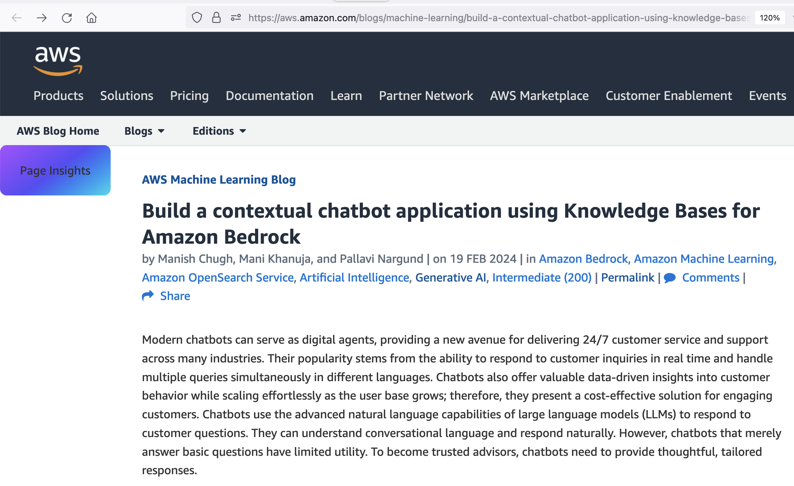

# page-insights

Use AI to summarize web pages

This project consists of a tampermonkey script for your web browser and an AWS serverless backend to call an LLM (large language AI model). Data and summaries are stored in S3. The project is designed to run very inexpensively in AWS. Leverages the python library, [litellm](https://docs.litellm.ai/docs/), which supports 100+ different LLMs including Amazon Bedrock, Azure, OpenAI, Cohere, Anthropic, Ollama, Sagemaker, HuggingFace, Replicate, etc.  You can configure the LLM you'd like to use in the [tampermonkey script](./tampermonkey.js).




## Deploy

### Pre-requisites

- Tampermonkey
- Bash
- Docker
- Terraform

### Steps

Optionally, create an s3 bucket to store terraform state
```sh
ACCOUNT=$(aws sts get-caller-identity --query Account --output text)
BUCKET=tf-state-${ACCOUNT}
aws s3 mb s3://${BUCKET}
```

Deploy using terraform
```sh
cd iac
terraform init -backend-config="bucket=${BUCKET}" -backend-config="key=page-insights.tfstate"
terraform apply
```

Take the `endpoint` from the terraform output and add it to your tampermonkey script when you register it.
```sh
Apply complete! Resources: 29 added, 0 changed, 0 destroyed.

Outputs:

endpoint = "https://123456789012.execute-api.us-east-1.amazonaws.com/"
lambda-app = "arn:aws:lambda:us-east-1:123456789012:function:page-insights"
lambda_llm = "arn:aws:lambda:us-east-1:123456789012:function:page-insights-llm"
```

```javascript
  const baseUrl = "https://123456789012.execute-api.us-east-1.amazonaws.com/";
```
